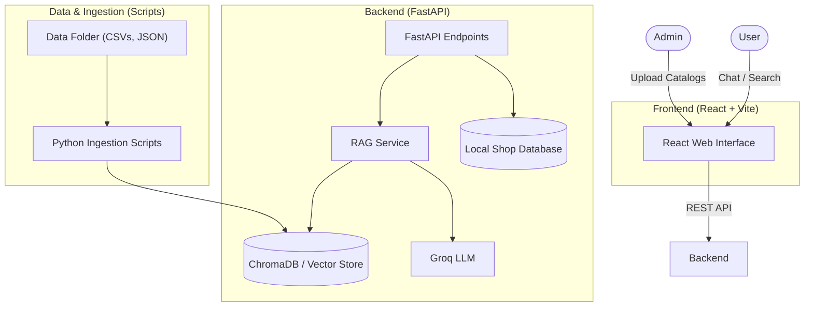

# Architecture Overview

This document outlines the high-level architecture and file structure of the **Intelligent Product Support Assistant**. 

The system follows a modern client-server architecture with a Retrieval-Augmented Generation (RAG) pipeline to provide accurate, grounded answers to user queries.

## High-Level System Diagram

## Directory Structure & Component Details

### 1. `frontend/` (User Interface)
Built with **React** and **Vite**, utilizing **Tailwind CSS** for styling.
- **Responsibilities:** 
  - Manage chat sessions in-memory.
  - Interface for cross-shop product search.
  - Admin dashboard to add/delete shops and upload datasets.
- **Key Files:** 
  - `package.json` & `vite.config.js`: Configuration and dependencies.
  - `src/`: React components, hooks, and API calling utilities.

### 2. `backend/` (API & RAG Engine)
Built with **Python** and **FastAPI**, serving as the core bridge between the frontend, the database, and the LLM.
- **Responsibilities:**
  - Provide RESTful endpoints for chat, search, and admin functions.
  - Manage state and operations for the local shop database.
  - Perform semantic retrieval using ChromaDB.
  - Generate answers using an LLM (e.g., Groq/Gemini).
- **Key Files:**
  - `main.py`: Contains the FastAPI application, routing, and endpoint definitions (e.g., `/chat`, `/shops`).
  - `rag_service.py`: Implements the RAG workflow (query -> embedding -> vector search -> LLM generation).
  - `db.py`: Handles local data persistence for shops and product catalogs.
  - `ingest.py`: Core logic for syncing and indexing products into the vector database.

### 3. `scripts/` (Data Ingestion & Evaluation)
A collection of standalone Python scripts for managing and evaluating knowledge.
- **Responsibilities:**
  - Batch process and clean support data.
  - Embed product documents and build the vector database offline.
  - Evaluate retrieval performance.
- **Key Files:**
  - `ingest_documents.py` & `ingest_shop.py`: Populates ChromaDB.
  - `clean_support_data.py` & `normalize_data.py`: Prepares raw data.
  - `evaluate_retrieval.py` & `test_shop.py`: Testing and validation utilities.

### 4. `data/` (Knowledge Base)
- **Responsibilities:** Stores the raw, approved product knowledge (CSVs, JSONs, PDFs) that acts as the source of truth for the system.

## Data Flow for a Chat Request
1. **Query:** The user sends a question via the React frontend.
2. **API Receipt:** FastAPI receives the request at the `POST /chat` endpoint.
3. **Retrieval:** The RAG service converts the query to an embedding and searches the local ChromaDB vector store for the most relevant product/support contexts.
4. **Generation:** The retrieved context, along with the user's query and chat history, is sent to the LLM.
5. **Response:** The LLM generates a grounded response, which is returned by the API and displayed to the user.